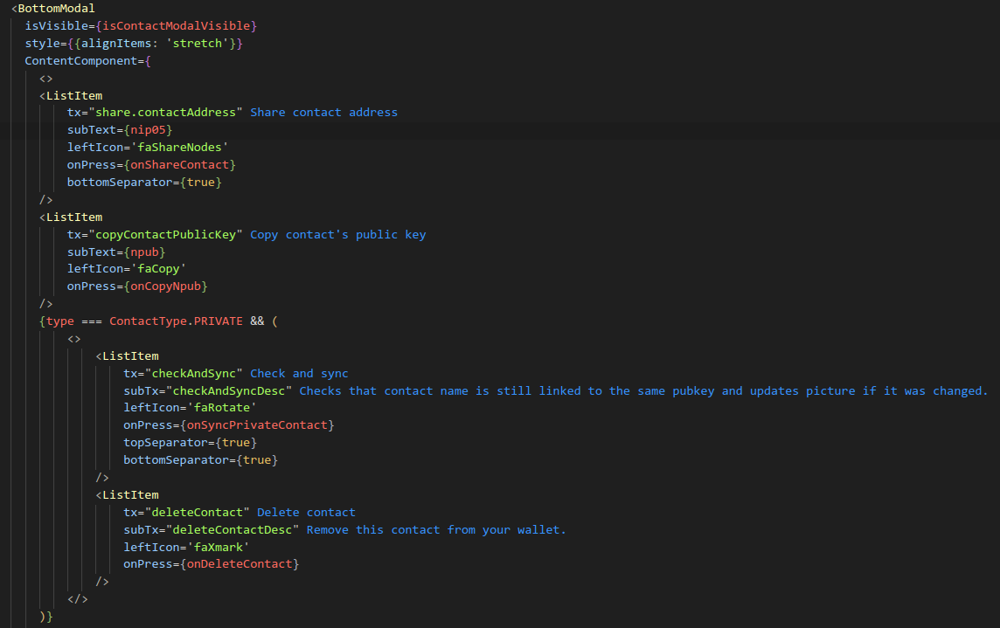

# inlang-t-function-jsx-hybrid-matcher
This is meant for inlang's sherlock extension to ease working with react/react-native apps that opted in to the inlang ecosystem.  
The actual i18n library can be different, what's important is that the   
  
- this plugin was originally based on the official `t-function matcher` plugin.  
- it was later fully rewritten to use [@babel/parser](https://babeljs.io/docs/babel-parser) since parsing nested jsx with Parsimmon's regex parsing language is brittle & unreliable

  
## features
- support arbitrary function calls (configurable, instead of just `t`)
	- e.g. `translate("some-id")`, `t("other-id")`, `myFunc("third-id")`
- support arbitrary jsx attributes (configurable)
	- e.g. `<Text tx="some-id" />`, `<Card titleTx="cardTitle" subTx="cardDesc"`
- add configuration in sherlock VSCode extension
	- config GUI might not work. 
	- in case config GUI doesen't, feel free to just configure it using the `settings.json` file in the `project.inlang` folder
  
  
  
## usage
add this to the `modules` array in `project.inlang/settings.json`:
```
https://cdn.jsdelivr.net/gh/KraXen72/inlang-t-function-jsx-hybrid-matcher/dist/index.js
```
pre-jsx version (possibly faster/simpler if you don't need jsx)
```
https://cdn.jsdelivr.net/gh/KraXen72/inlang-t-function-jsx-hybrid-matcher@021003e/dist/index.js
```

you can configure this matcher in Sherlock VSCode extension or in `project.inlang/settings.json`.

## development usaage
dev: use the path to the built index.js:
```
"/media/win/coding/node-deno/inlang-t-function-jsx-hybrid-matcher/dist/index.js"
```
or:
```
"D:/coding/node-deno/inlang-t-function-jsx-hybrid-matcher/dist/index.js"
```
  
Feel free to open issues about bugs. Feature requests likely won't be implemeted.  
I wrote this for https://github.com/minibits-cash/minibits_wallet  